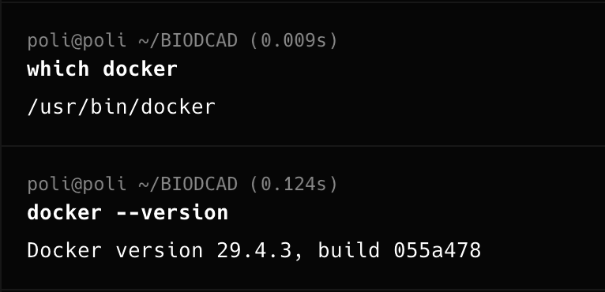
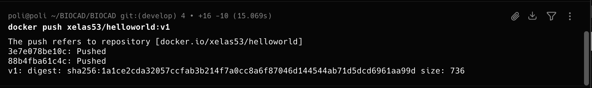
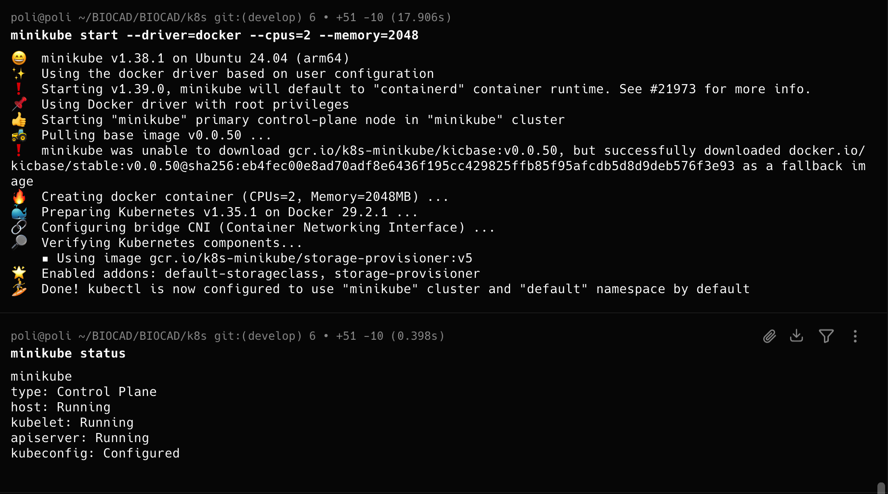
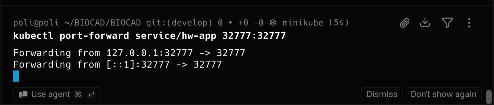

# Hello World — Docker & Kubernetes

Простое веб-приложение на C.

Приложение работает на порту `32777`.

## Структура проекта

```text
BIOCAD/
├── Dockerfile
├── Makefile
├── README.md
├── app
│   └── helloworld.c
└── k8s
    ├── deployment-app.yaml
    └── service.yaml
```

## Запуск локально

Сборка:

```bash
make
```

Запуск:

```bash
./app/helloworld
```

Проверка:

```bash
curl http://localhost:32777
```

Результат:

```text
hello world
```

## Docker

Для сборки используется multi-stage Dockerfile

Сборка Docker-образа:

```bash
docker build -t xelas53/helloworld:v1 .
```

Запуск контейнера:

```bash
docker run --rm -p 32777:32777 xelas53/helloworld:v1
```

Проверка:

```bash
curl http://localhost:32777
```

Результат:

```text
hello world
```

Docker image:

```text
xelas53/helloworld:v1
```

## Kubernetes

Для Kubernetes используется Minikube.

Запуск Minikube:

```bash
minikube start --driver=docker --cpus=2 --memory=2048
```

Создание Deployment:

```bash
kubectl apply -f k8s/deployment-app.yaml
```

Deployment запускает 2 реплики приложения

Проверка Pods:

```bash
kubectl get pods -o wide
```

Создание Service:

```bash
kubectl apply -f k8s/service.yaml
```

Проверка Deployment и Service:

```bash
kubectl get deployment,service
```

Для доступа к приложению используется Service типа `NodePort`.

## Port forwarding

Для доступа к приложению через localhost:

```bash
kubectl port-forward service/hw-app 32777:32777
```

В другом терминале:

```bash
curl http://127.0.0.1:32777
```

Результат:

```text
hello world
```

Приложение также можно открыть в браузере:

```text
http://127.0.0.1:32777
```

## Архитектура


## Скриншоты

### Docker



### Docker Hub



### Kubernetes



### Port forwarding


